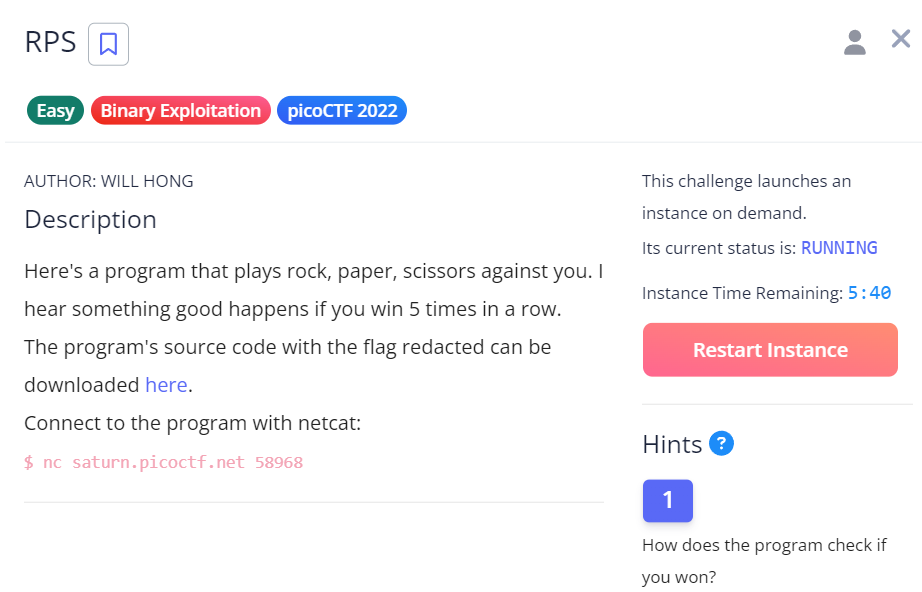
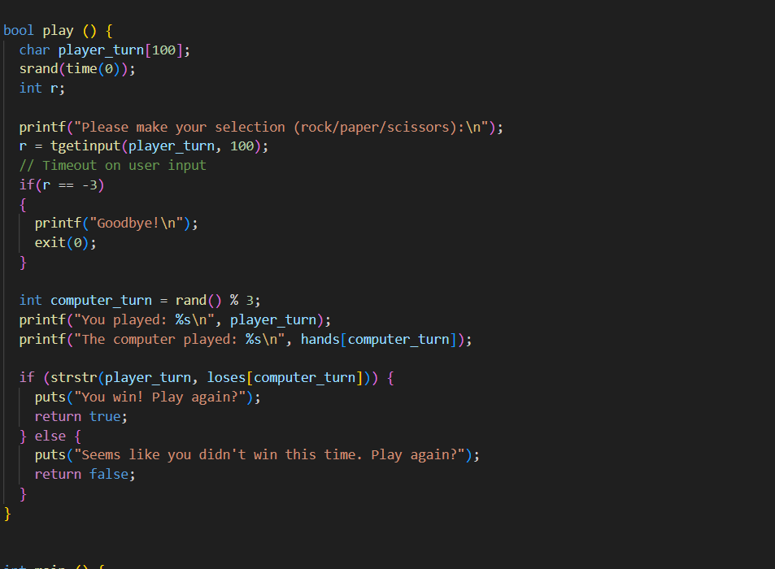
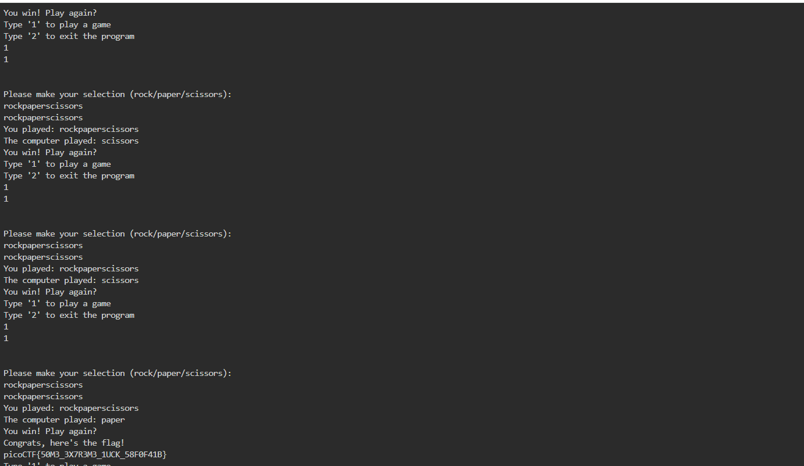

# RPS

This is the write-up for the challenge "RPS" challenge in PicoCTF

# The challenge

## Description
Here's a program that plays rock, paper, scissors against you. I hear something good happens if you win 5 times in a row.

## Hints
How does the program check if you won?

## Initial look
Upon inspecting the game code, it was observed that the game uses the strstr function to check if the player has won. 
This function checks for the presence of one string within another.
 This means that if the player's input string contains the winning string, the game will register a win.

# How to solve it
Given the behavior of the strstr function, the solution involves crafting an input string that contains all possible winning
 outcomes concatenated together. The string "rockpaperscissors" covers all possible winning combinations in a single sequence.

By entering this string five times in a row, the game mistakenly registers five consecutive wins.

The flag is picoCTF{50M3_3X7R3M3_1UCK_58F0F41B}