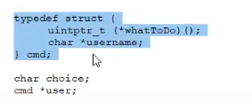
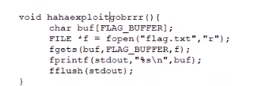
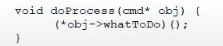
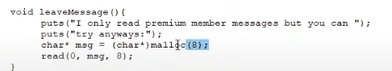
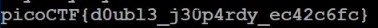

# README #
This is the write-up for the challenge "unsubscriptions are free" challenge in PicoCTF

# Description
Check out my new video-game and spaghetti-eating streaming channel on Twixer! program and get a flag. 
source nc mercury. picoctf.net 6312 - inside the directory: vuln.c file
hint:
1. http://homes.sice.indiana.edu/yh33/Teaching/I433-2016/lec13-HeapAttacks.pdf
# How to solve it

there's a link on heap attacks.

we have this command it's going to be 8 bytes since this is 32-bit architecture
# 
so we have a 4 byte pointer
on what to do and a 4x8 pointer on the username we have a method here which is going to
happily read the flag and print it out for us this is good 
# 
and this program that gets a line
this is a function pointer
# 
so if we can fill in

this is going to be a malloc 
# 
of size 8 and 8 is interesting because it's the
exact size of the command buffer

now i create simple python program
# 

and the flag is:
# 