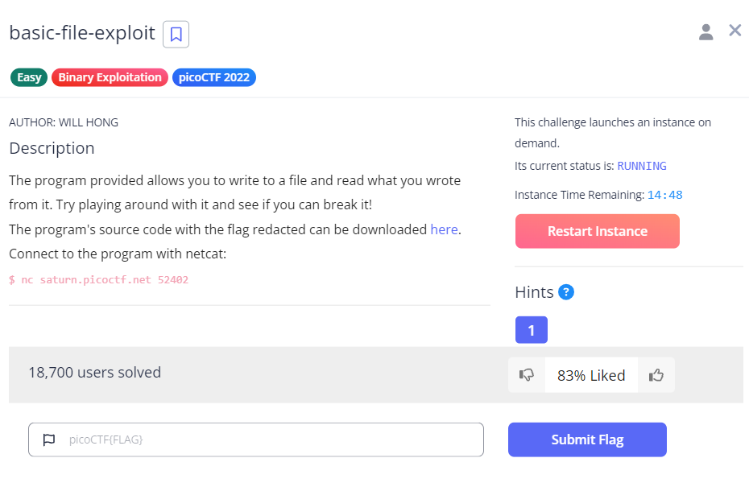
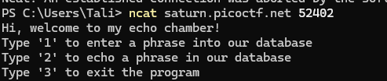
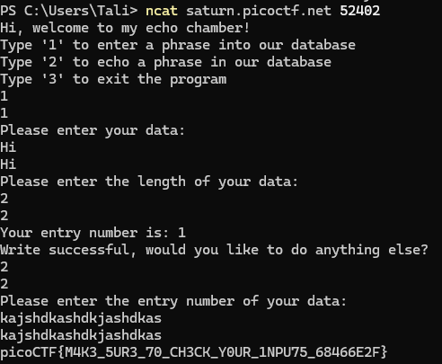

# basic-file-exploit

This is the write-up for the challenge "basic-file-exploit" in PicoCTF

# The Challenge

## Description
The program provided allows you to write to a file and read what you wrote from it. Try playing around with it and see if you can break it!
The program's source code with the flag redacted can be downloaded here.
Connect to the program with netcat:
$ nc saturn.picoctf.net 52402

## Hints
Try passing in things the program doesn't expect. Like a string instead of a number.

## Initial look

When running the command you are presented with a list of opitions

# How to Solve it

You must enter input that the program does not expect. I first entered data as expected and then I simply entered a string of gibberish: 

Voila!

The flag is:
picoCTF{M4K3_5UR3_70_CH3CK_Y0UR_1NPU75_68466E2F}