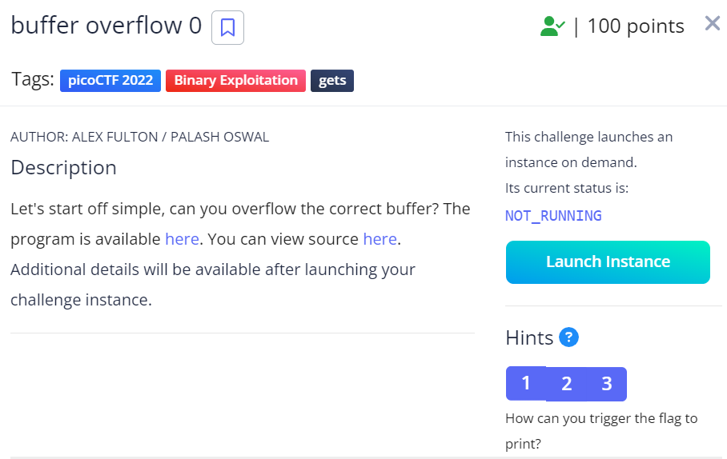
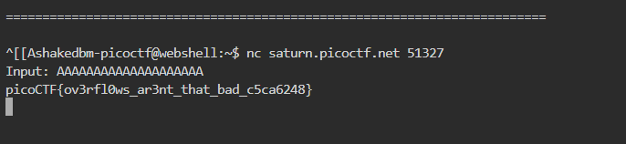

# buffer overflow 0

This is the write-up for the challenge "buffer overflow 0" challenge in PicoCTF

# The challenge

## Hints
1. How can you trigger the flag to print?
2. If you try to do the math by hand, maybe try and add a few more characters. Sometimes there are things you aren't expecting.
3. Run man gets and read the BUGS section. How many characters can the program really read?

## Initial look
I clicked on the link to view the source and I got the following C code:

#include <stdio.h>
#include <stdlib.h>
#include <string.h>
#include <signal.h>

#define FLAGSIZE_MAX 64

char flag[FLAGSIZE_MAX];

void sigsegv_handler(int sig) {
printf("%s\n", flag);
fflush(stdout);
exit(1);
}

void vuln(char* input) {
char buf2[16];
strcpy(buf2, input);
}

int main(int argc, char** argv) {

    FILE* f = fopen("flag.txt", "r");
    if (f == NULL) {
        printf("%s %s", "Please create 'flag.txt' in this directory with your",
            "own debugging flag.\n");
        exit(0);
    }

    fgets(flag, FLAGSIZE_MAX, f);
    signal(SIGSEGV, sigsegv_handler); // Set up signal handler

    gid_t gid = getegid();
    setresgid(gid, gid, gid);

    printf("Input: ");
    fflush(stdout);
    char buf1[100];
    gets(buf1);
    vuln(buf1);
    printf("The program will exit now\n");
    return 0;
}

# How to solve it
I opened the picoCTF shell and run 'nc saturn.picoctf.net 51327'. then it asked for an input.   
I read the C code and I understand that I need to provide an input that overflows the buffer buf2 in the vuln function.  
In the code I see that buf2 is 16 bytes long, so it means any input longer than that will overflow the buffer.  
I entered the input 'AAAAAAAAAAAAAAAAAAAA' which is 20 characters.  
Then, I got the flag  
  

I copied the flag and paste it on PicoCTF task, then I got a message that I earned 100 points.  

The flag is: picoCTF{ov3rfl0ws_ar3nt_that_bad_c5ca6248}  

