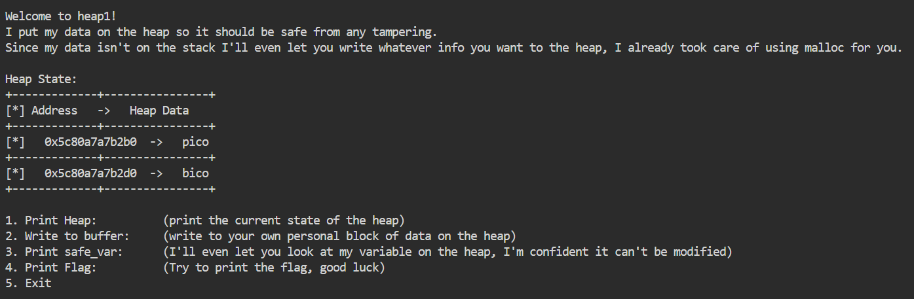

# heap 1 

This is the write-up for the challenge "heap 1" challenge in PicoCTF

# The challenge

## Description
Can you control your overflow?
Download the binary [here](https://artifacts.picoctf.net/c_tethys/32/chall).
Download the source [here](https://artifacts.picoctf.net/c_tethys/32/chall.c).
Connect with the challenge instance here:
`nc tethys.picoctf.net 58246`

## Initial look
* We need to download 2 files - binary file and source file (chall.c). 
* open picoCTF Webshell and type - `nc tethys.picoctf.net 58246`

# How to solve it
* after enter `nc tethys.picoctf.net 58246` into the shell, it prints some text and table woth two addresses and data 

* when type command '3' that soppuse to print 'safe_var' i get: `safe_var = bico`,  i want to change the safe var
* i opened 'chall.c' file and saw that it checks if 'safe_var' == 'pico' and if so, it print 'YOU WIN', and then, if i type command '4' it return the flag only if the status change to 'win'.
* so to change the buffer i can choose command '2', but then it writes only for the first buffer (the one with the initial 'pico' text).
* to write to the other buffer i can give some data of 32bits long, and after that the needed text so i wrote - `12345678901234567890123456789012pico`
* print the table again and i can see the second buffer changed to 'pico', so i asked to print the flag and got `YOU WIN
picoCTF{starting_to_get_the_hang_e9fbcea5}`

## flag
The flag is `picoCTF{starting_to_get_the_hang_e9fbcea5}`

Cheers 😄