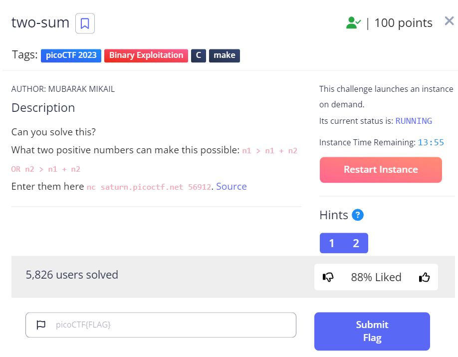

# two-sum

This is the write-up for the challenge "two-sum" challenge in PicoCTF

# The challenge
**two-sum**

## Description
1. Can you solve this?
2. What two positive numbers can make this possible: n1 > n1 + n2 OR n2 > n1 + n2
3. Enter them here `nc saturn.picoctf.net 56912`. [Source](https://artifacts.picoctf.net/c/455/flag.c)



## Hints
1. Integer overflow
2. Not necessarily a math problem

(But I didn't use it)

## Initial look
When I clicked on the link to the Source, I got a C code. I read the code and found that it was a simple code that takes two numbers as input and checks if the sum of the two numbers is greater than the first number or the second number. If it is, then it prints the flag.

```c
#include <stdio.h>
#include <stdlib.h>

static int addIntOvf(int result, int a, int b) {
    result = a + b;
    if(a > 0 && b > 0 && result < 0)
        return -1;
    if(a < 0 && b < 0 && result > 0)
        return -1;
    return 0;
}

int main() {
    int num1, num2, sum;
    FILE *flag;
    char c;

    printf("n1 > n1 + n2 OR n2 > n1 + n2 \n");
    fflush(stdout);
    printf("What two positive numbers can make this possible: \n");
    fflush(stdout);
    
    if (scanf("%d", &num1) && scanf("%d", &num2)) {
        printf("You entered %d and %d\n", num1, num2);
        fflush(stdout);
        sum = num1 + num2;
        if (addIntOvf(sum, num1, num2) == 0) {
            printf("No overflow\n");
            fflush(stdout);
            exit(0);
        } else if (addIntOvf(sum, num1, num2) == -1) {
            printf("You have an integer overflow\n");
            fflush(stdout);
        }

        if (num1 > 0 || num2 > 0) {
            flag = fopen("flag.txt","r");
            if(flag == NULL){
                printf("flag not found: please run this on the server\n");
                fflush(stdout);
                exit(0);
            }
            char buf[60];
            fgets(buf, 59, flag);
            printf("YOUR FLAG IS: %s\n", buf);
            fflush(stdout);
            exit(0);
        }
    }
    scanf("%d", &num1);
    return 0;
}
```

# How to solve it

## Step 1
I open the picoCTF shell and run the `nc saturn.picoctf.net 56912` command. It asks for two numbers. I enter `1` and `2` and it says `You entered 1 and 2`
`No overflow`.

## Step 2
I read the code and found that the flag is in the `flag.txt` file. So, I need to find a way to get the flag.

## Step 3
I read the code and found that the sum of the two numbers is checked for overflow. If there is an overflow, then it prints `You have an integer overflow`. So, I need to find a way to get an overflow.

## Step 4
I tried to enter a large number' `2000000000` and `2000000000` and it says `You have an integer overflow`.
and when I enter it in the shell, it says `You have an integer overflow`
`YOUR FLAG IS: picoCTF{Tw0_Sum_Integer_Bu773R_0v3rfl0w_fe14e9e9}`

Voila!!! 😎

The flag is `picoCTF{Tw0_Sum_Integer_Bu773R_0v3rfl0w_fe14e9e9}`

Cheers 😄