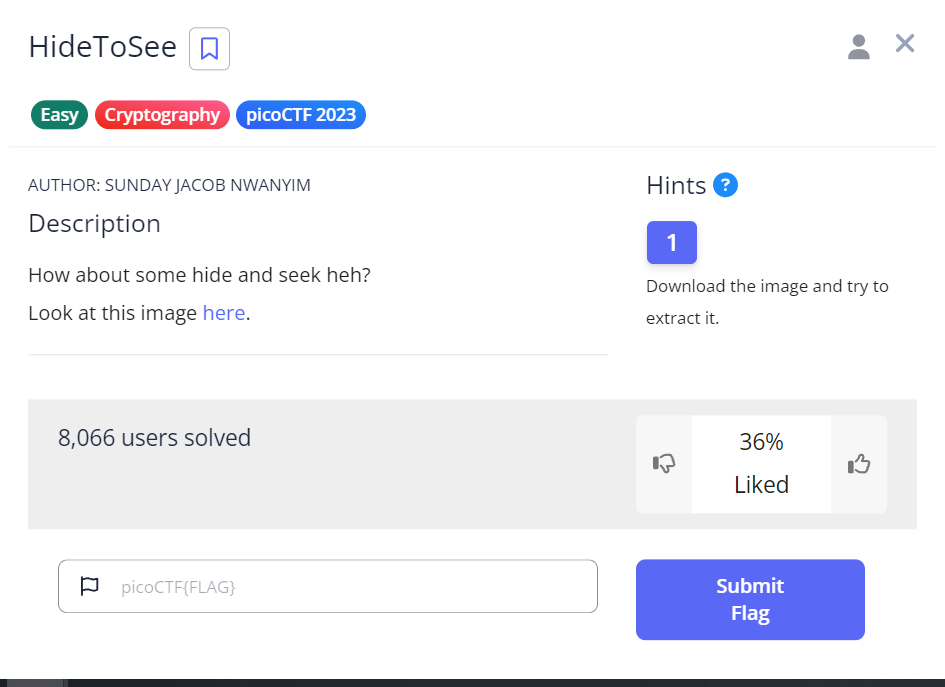
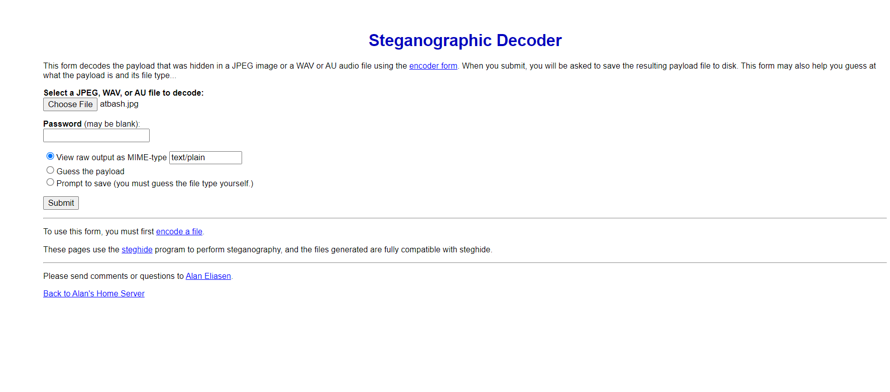
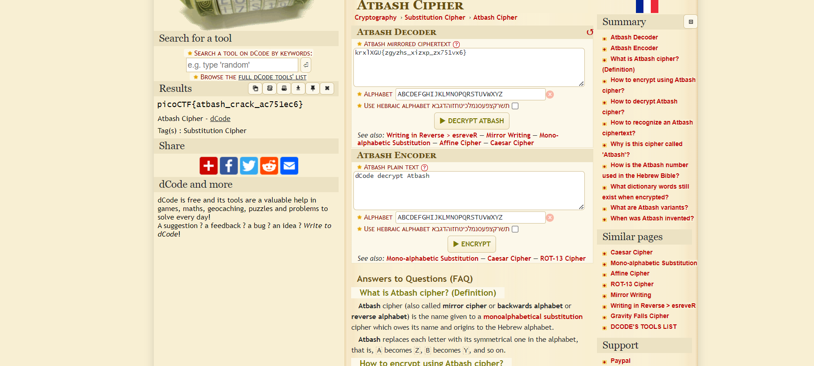

# HideToSee

This is the write-up for the "Hide to see" challenge in PicoCTF.

## The Challenge

### Description

How about some hide and seek, heh? Look at this image here:

### Hints

Download the image and try to extract it.

## Initial Look

The image showed the Atbash code:

## How to Solve It
I researched methods for extracting hidden payloads from JPEG images and found a website, [FutureBoy's Steganography Decoder](https://futureboy.us/stegano/decinput.html), which allows you to upload an image and discover any hidden data.

After uploading the image, I received the following code:
krxlXGU{zgyzhs_xizxp_zx751vx6}

By decrypting it using an Atbash decoder, I obtained the flag:

picoCTF{atbash_crack_ac751ec6}

