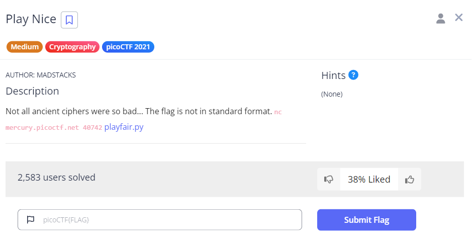
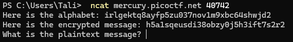
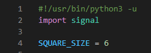
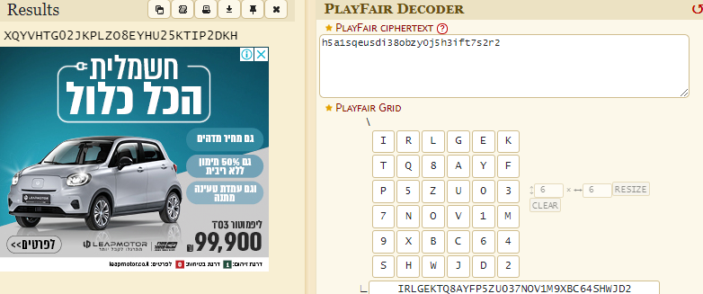
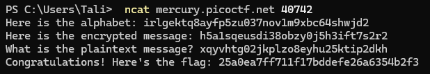

# Play Nice

This is the write-up for the challenge "Play Nice" in PicoCTF

# The Challenge

## Description
Not all ancient ciphers were so bad... The flag is not in standard format. nc mercury.picoctf.net 40742 playfair.py

## Hints
None

## Initial Look
You are provided with a netcat command and a python script.

# How to Solve it

For this exercise we are provided with two simple items. One is a terminal command and the other is a python script that implements playfair's cipher algorithm.

When running the terminal command we receive the following output:

The code is requesting the plain text while conveniently also providing us with the alphabet used.

Using the site: https://www.dcode.fr/playfair-cipher to help decode this message I entered the ciphered text as well as the grid size which could be found as a global variable in the python script and the grid contents which is the alphabet provided.

Once all of this information was gathered, I inputed it into the website and received the following:

I converted the plain text to lower case and entered it, receiving the flag:

Voila!

The flag is:
25a0ea7ff711f17bddefe26a6354b2f3