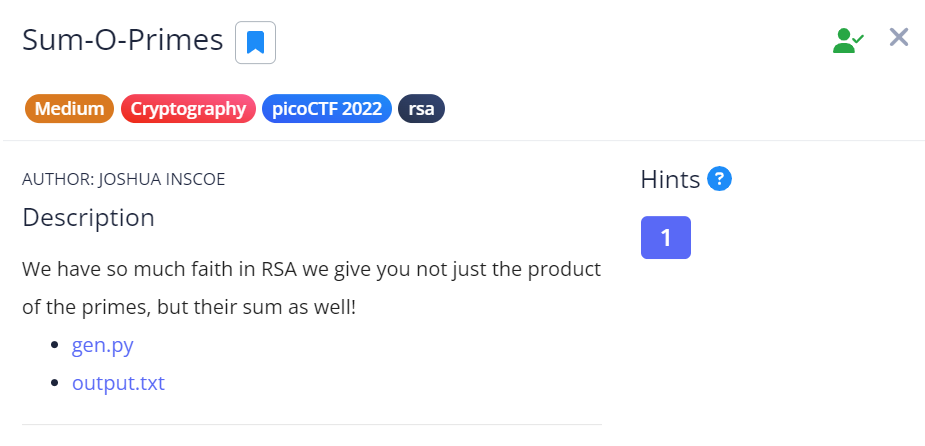

# Sum O Primes #

This is the write-up for the challenge "Sum-O-Primes" challenge in PicoCTF

## The challenge ##

### Description ###
you can find the challenge [here](https://play.picoctf.org/practice/challenge/310)  
the challenge says:  
> We have so much faith in RSA we give you not just the product of the primes, but their sum as well!  
> * [gen.py](files/gen.py)
> * [output.txt](files/output.txt)


 

## How I Solve The Challenge ##
After reading the code we can understand that the program use RSA and send us 4 thing  
* `n = p * q` the regular `n` from RSA
* `x = p + q` the sum of q and p
* `e = 65537` the regular e from RSA
* `c = FLAG ^ e % n` - the flag after encryption

RSA encryption based on that its hard to find the primes `p` and `q` for given `n = p*q`, but for us its pretty easy because we also have `x = p + q`

Lets find p and q:
```math
\begin{align*}
n &= p \cdot q \\
x &= p + q \\
&\therefore\\
n &= p \cdot (x-p)\\
p^2 - x \cdot p +n &= 0\\
p,q &= \frac{x\pm\sqrt{x^2-4\cdot n}}{2}
\end{align*}
```

After receiving `p` and `q` we can get `d` as the regular algorithm do, then find the message by $c^d$.  
Writing a little program that do so as [sol.py](files/sol.py)

Using the program we wrote we receive the flag `picoCTF{pl33z_n0_g1v3_c0ngru3nc3_0f_5qu4r35_24929c45}`

Voila!!! 😎  
The flag is `picoCTF{and_down_the_road_we_go_dbb7ff66}`  
Cheers 😄  

