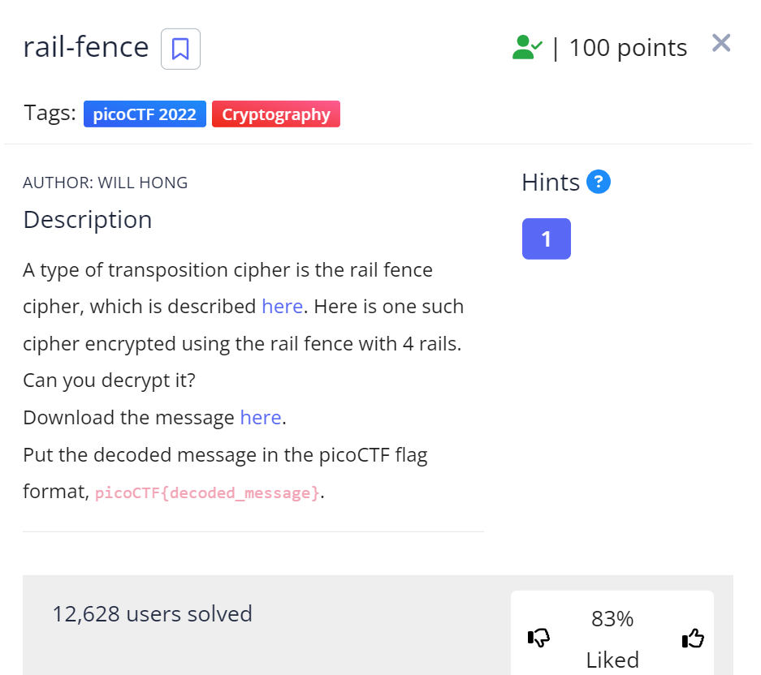
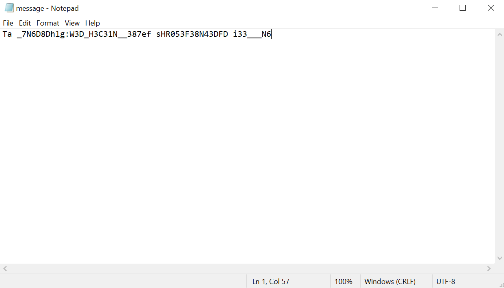
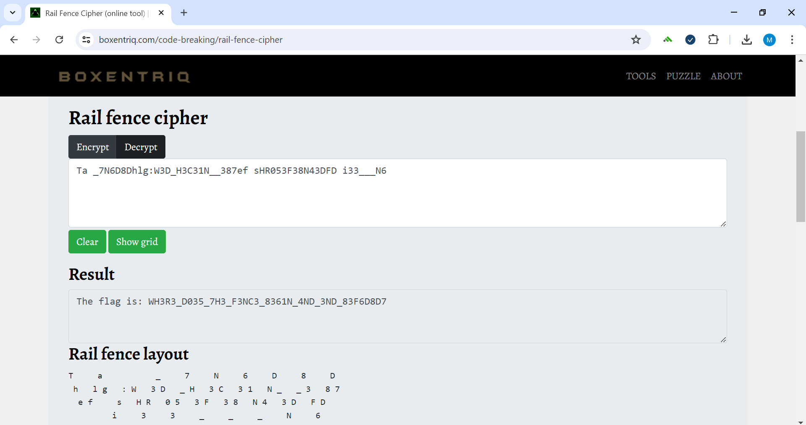

# rail-fence
This is the write-up for the "rail-fence" challenge in PicoCTF.

# The challenge

# Hints
1. Once you've understood how the cipher works, it's best to draw it out yourself on paper

# How to solve it
First I clicked on the first link which is the Wikipedia page of the cipher. 

After understanding how the cipher works, I clicked on the second link which downloaded this message

I went over to this [website](https://www.boxentriq.com/code-breaking/rail-fence-cipher) and decoded the message and found the flag

The flag is: picoCTF{WH3R3_D035_7H3_F3NC3_8361N_4ND_3ND_83F6D8D7}

