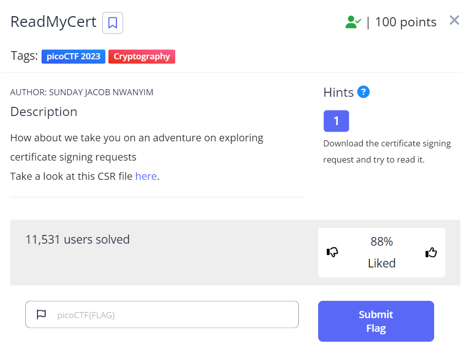
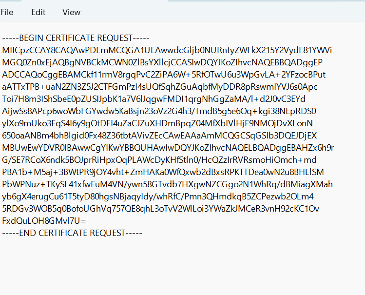
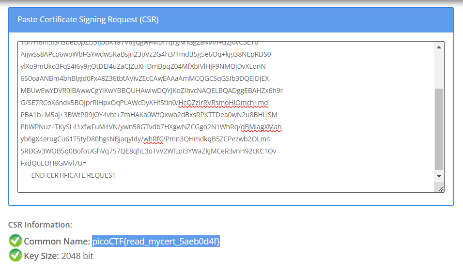

# Read My Cert

This is the write-up for the challenge "ReadMyCert" challenge in PicoCTF

# The challenge

## Hints
Download the certificate signing request and try to read it.

## Initial look
I downloaded a CSR file from the link above.

# How to solve it
I got the file "readmycert.csr" and I opened it via Notepad. the file contains:

Then, I checked on Google how to decode a CSR file. I found the site https://www.sslshopper.com/csr-decoder.html
this site called SSL shopper, and it has a CSR decoder.
I pasted the content of the CSR file I got before, and then I got the flag:

I copied the flag and paste it on PicoCTF task, then I got a message that I earned 100 points.

