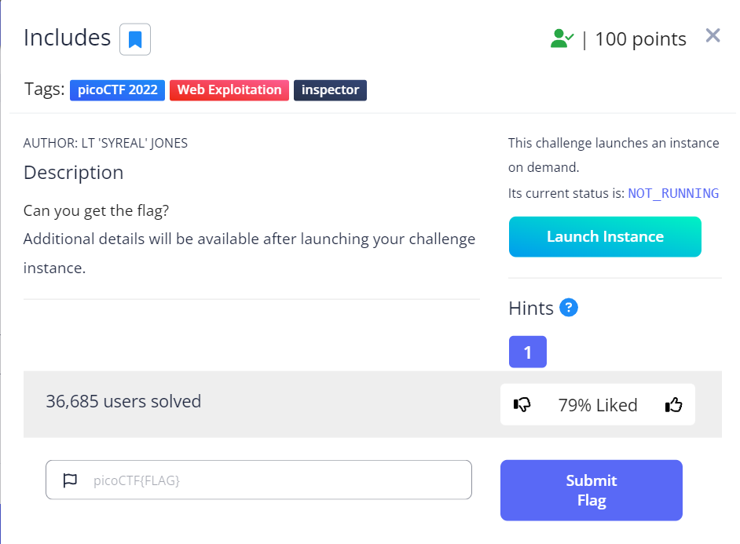
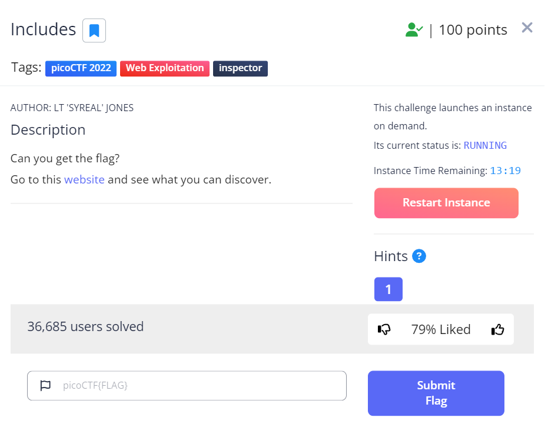
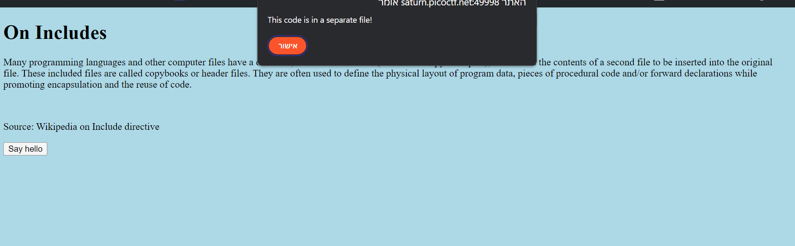
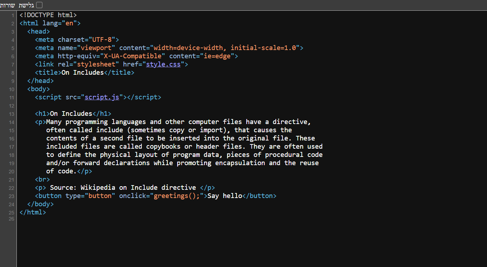
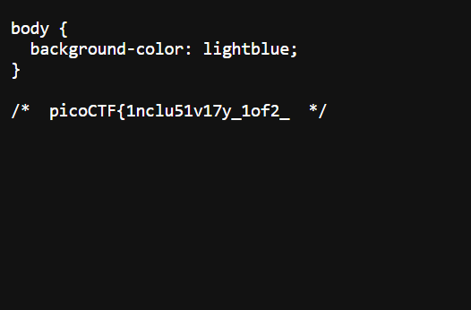
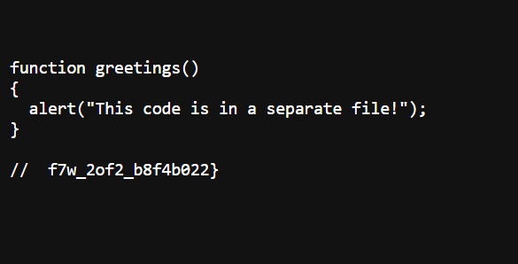

# Includes

This is the write-up for the challenge "Includes" challenge in PicoCTF

# The challenge
**Includes**

## Description
1. Can you get the flag?
Additional details will be available after launching your challenge instance.

2. Can you get the flag?
Go to this [website](http://saturn.picoctf.net:49998/) and see what you can discover.

http://saturn.picoctf.net:49998/





## Hints
1. Is there more code than what the inspector initially shows?

(But I didn't use it)

## Initial look
The above link takes you to a basic HTML page where you find a quote from Wikipedia of the entry: **"Include directive"**.
Below the quote appears a button with the inscription: **"Say hello"**.
When you click the button, a message appears: **"This code is in a separate file!"**.




# How to solve it

## Step 1
I open the developer tools and look at the source code of the page.



## Step 2
In the source code I saw that the site uses two Includes:
```html
<link rel="stylesheet" href="style.css">
```
and
```html
<script src="script.js"></script>
```

## Step 3
I went into **"style.css"** and saw that there is half of the flag in it as documentation of the code.



## Step 4
I went into **"script.js"** and saw that there is the other half of the flag in it as documentation of the code.



Voila!!! 😎

The flag is `picoCTF{1nclu51v17y_1of2_f7w_2of2_b8f4b022}`

Cheers 😄