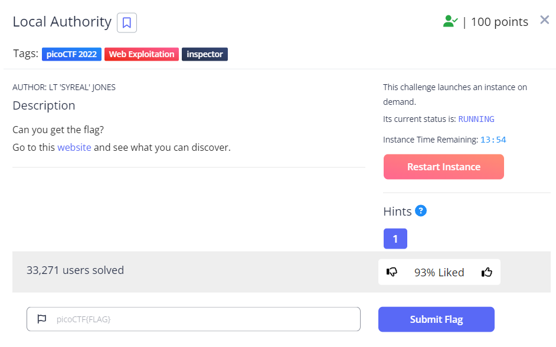
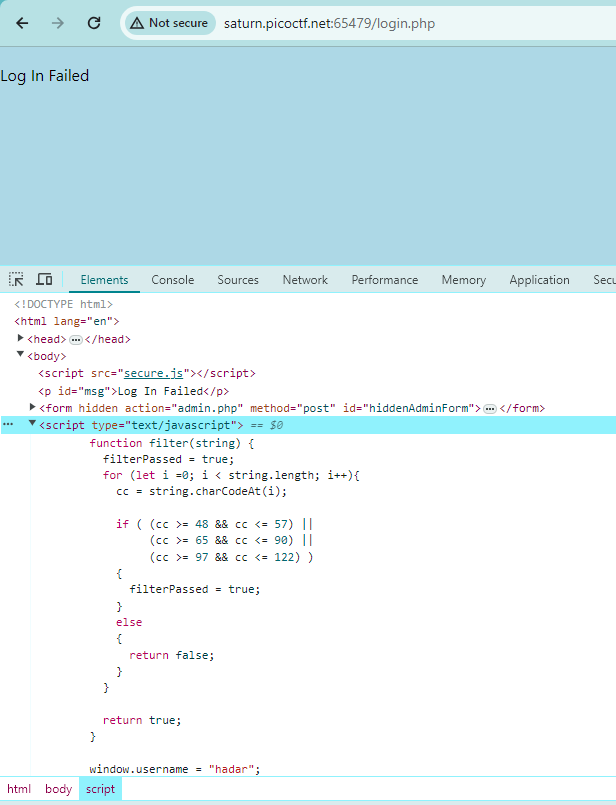
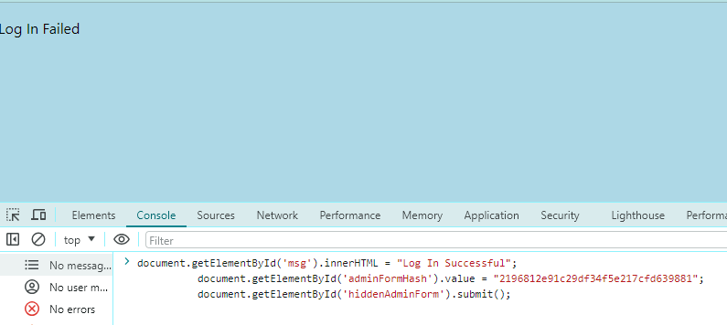
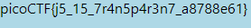

# Local Authority

This is the write-up for the challenge "Local Authority" challenge in PicoCTF

# The challenge

## Description
Can you get the flag?
Additional details will be available after launching your challenge instance.
the website:http://saturn.picoctf.net:56886/

## Hints
1. How is the password checked on this website?

## Initial look
The above link brings you to a basic HTML page where you can write username and password and a login button.

# How to solve it

First of all I entered the site. I saw that it says that the username and password can only contain letters and numbers.
I saw that I had no more hints inside, so I went to the hint they gave.
The hint told me to go check how the password is checked on this page.
I entered the Inspect.

I just wrote a username and password and clicked login.
Next I looked at Elements.
I looked at the code and read how they check the password.
I saw that it is not written how the test itself that the username and password are correct,
but it is written there what to do in case they are correct - that is, how to enter them into the html.

I realized that because I'm on the client side, what I see in the code are things I can use. 
I took these three lines, and copied them to the console.
This is before I press enter:

These commands caused the username and password I wrote to be correct and the flag was printed to my screen

The flag is `picoCTF{j5_15_7r4n5p4r3n7_a8788e61}`

Thanks 😄

Hadar Liel Harush