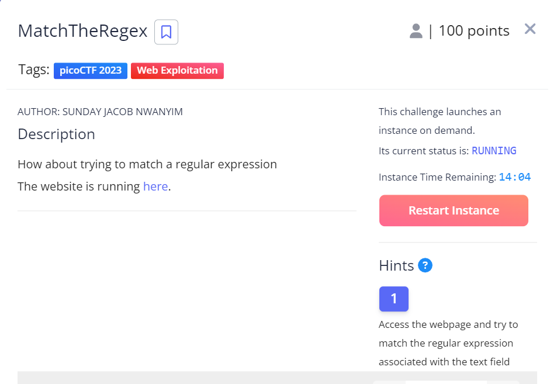
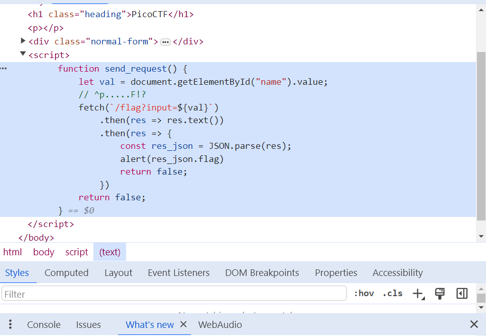
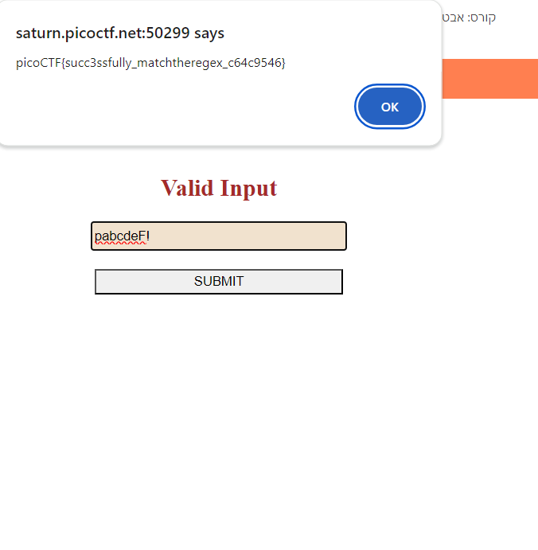

# Match The Regex
This is the write-up for the challenge "MatchTheRegex" challenge in PicoCTF

# The challenge
Match a regular expression

## Hints
1. Access the webpage and try to match the regular expression associated with the text field

## Initial look
The link bring us to an HTML page. The title is "Valid Input" and it has an input box and submit button under it.

## How to solve it
I looked at the HTML code by doing inspect elements.  
I saw that there is a script tag, so I opened it and I saw a fetch req to the server.  
Also, I saw in the script the comment: // ^p.....F!? , that it reminds a regular expression.  
So, I tried the input "pabcdeF!" . then I submitted the answer and I got the flag.  
The flag is: picoCTF{succ3ssfully_matchtheregex_c64c9546}  

