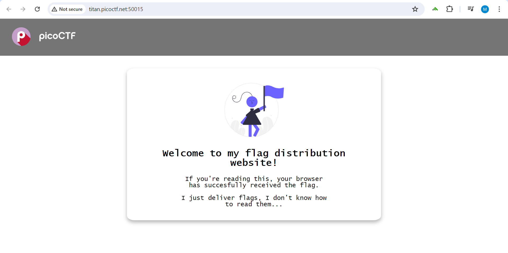
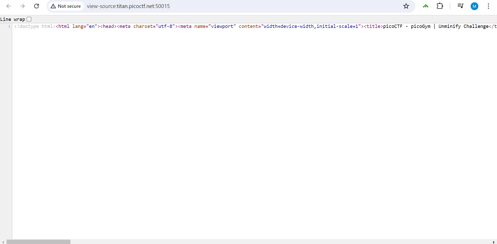
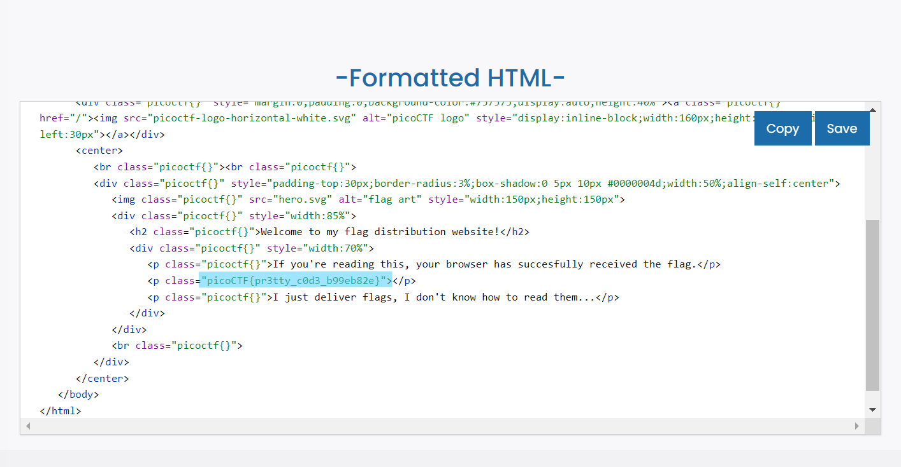

# Unminify
This is the write-up for the "Unminify" challenge in PicoCTF.

# The challenge

## Description
I don't like scrolling down to read the code of my website, so I've squished it. As a bonus, my pages load faster!
Browse [here](http://titan.picoctf.net:50015/), and find the flag!

# Hints
1. Try CTRL+U / ⌘+U in your browser to view the page source. You can also add 'view-source:' before the URL, or try curl <URL> in your shell.
2. Minification reduces the size of code, but does not change its functionality.
3. What tools do developers use when working on a website? Many text editors and browsers include formatting.

# How to solve it

First I clicked on the link that was given and I got this page

The flag is nowhere to be found, so I clicked on View page source 

The html code is not well formatted, so I used this [website](https://www.freeformatter.com/) to organize the html code

I got the flag!!  
The flag is: picoCTF{pr3tty_c0d3_b99eb82e}

