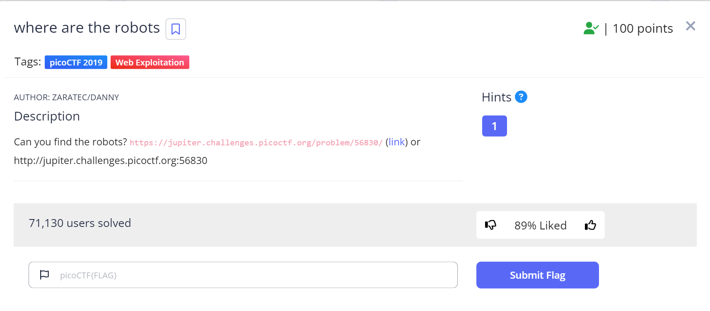
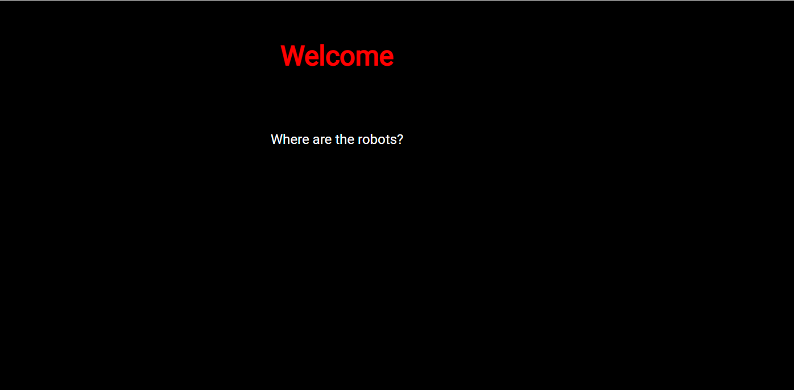
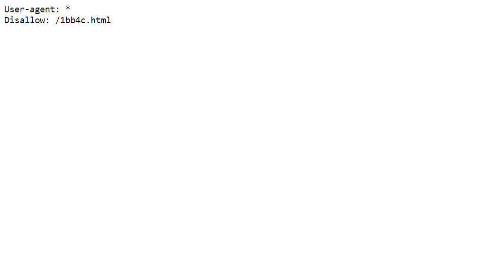
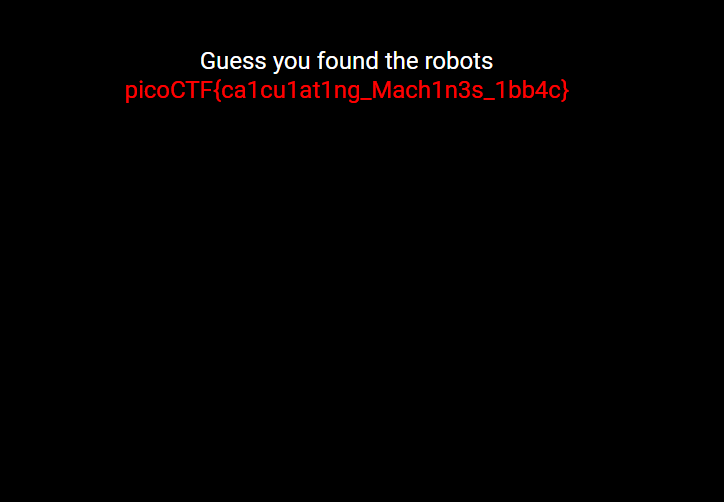

# Where are the robots

This is the write-up for the challenge "Where are the robots" challenge in PicoCTF
## Description
Can you find the robots? https://jupiter.challenges.picoctf.org/problem/56830/ (link) or http://jupiter.challenges.picoctf.org:56830

## Hint
1. What part of the website could tell you where the creator doesn't want you to look?

## Initial look
The above link brings you to a basic HTML welcome page with black background and "Welcome, Where are the robots" text.

# How to solve it

First i went to view the page source and theres no much going on there,
then i went to open the dev tools to look at the sources.
we have stylesheet which look pretty plain and nothing else.
so now i look at the hint: "Which part of the website could you tell where the creator doesnt wanty you to look?"
the answer is robots.txt file. so i went to https://jupiter.challenges.picoctf.org/problem/56830/robots.txt
and there i got the

then i entered https://jupiter.challenges.picoctf.org/problem/56830/1bb4c.html
and recieved the answer:

The flag is `picoCTF{ca1cu1at1ng_Mach1n3s_1bb4c}`

Cheers 😄