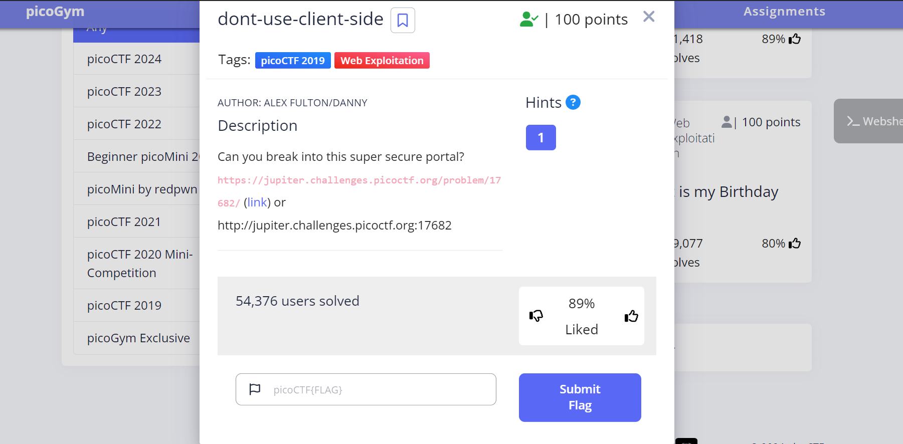
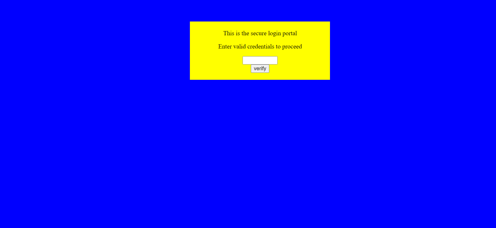
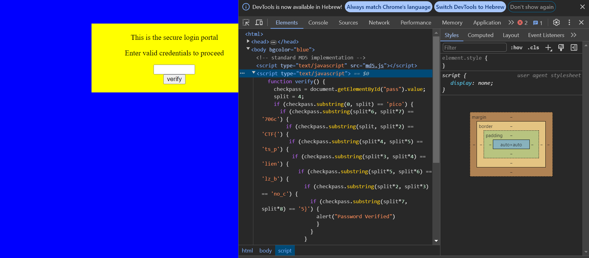
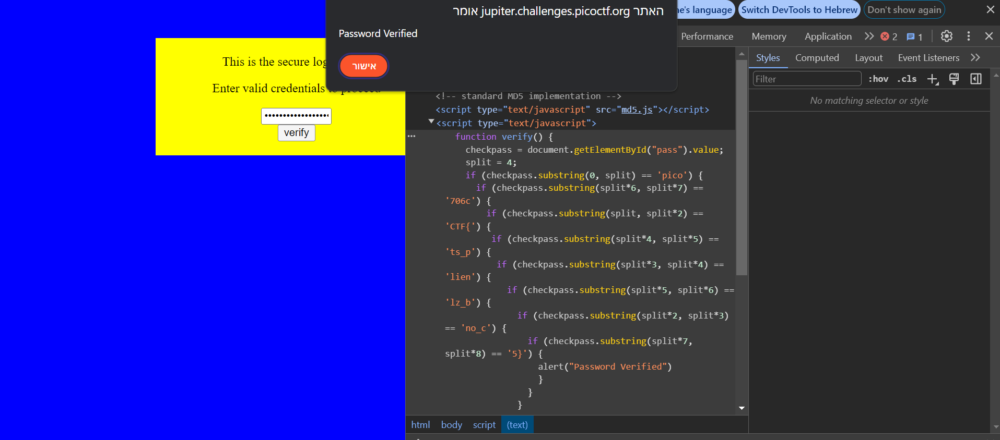

The link of the challenge: https://play.picoctf.org/practice/challenge/66?category=1&page=1  
Go into the link.  
You should see this page:  
  
Go to the link inside.  
You should see this:  
  
Open inspect and open the full script:  
  
Now you have the password.  
You just need to enter it by order.

the challenge is solved.  
The flag is: picoCTF{no_clients_plz_b706c5}