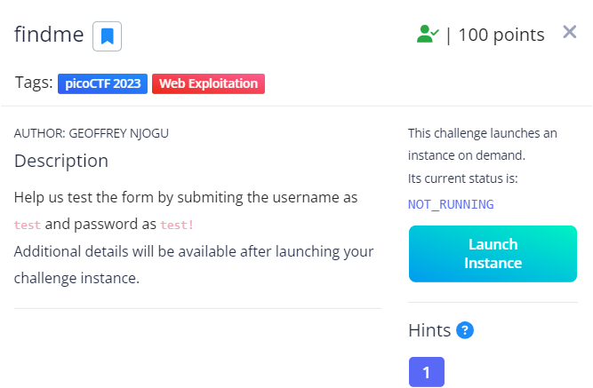
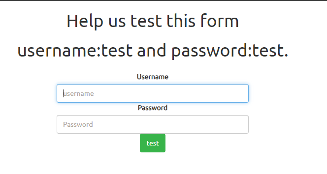
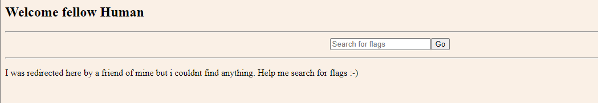
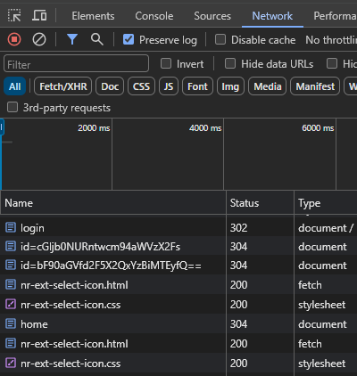
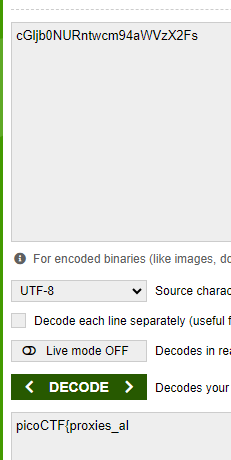
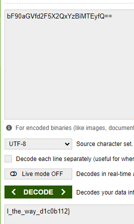
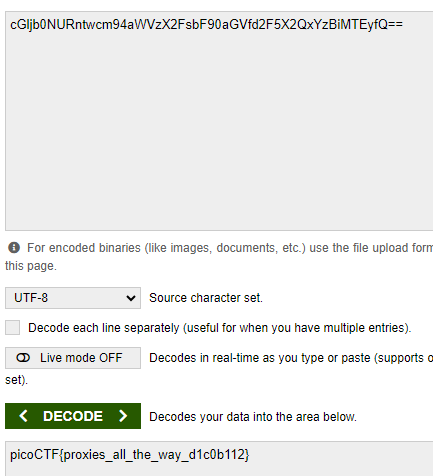

# findme

This is the write-up for the challenge "findme" in PicoCTF

# The Challenge

## Description
Help us test the form by submiting the username as test and password as test!
Additional details will be available after launching your challenge instance.

## Hints
any redirections?

## Initial look
Once launching the instance, you are provided with a web address that presents a login page requiring a username and password.

# How to solve it

Initially I did not look at the hint and continued to the login page entering the username and password provided in the challenge description. After logging in you are presented with another page that includes a search bar.

I started my search for the flag here (a mistake I realized later on) by opening the chrome inspect tool and analyzing the html/javascript code for the page. I spent quite a bit of time playing around with this code until feeling stumped and noticing that it did not appear suspicious at all. 

I realized I was not having luck at all looking at this page and peeked at the hint provided: "any redirections?". The only redirection I could recall was the login page to the main page (as the search bar does not really submit the form and is therefore not redirected to another page).

I returned to the login page, inspecting again the html code seeing nothing in particular and then entered the username and password again. This time something caught my eye. Paying close attention, you can see the page is redirected a couple of times before it ends at the final page we saw previously. Opening the inspect tool again and returning to the login page I checked off the "Perserve Log" in the Network Tab and logged in again.

This is what appeared in the logs:

You can see there are two numbers that look to be in the same format. After some googling, I learned that this format is Base64 and there are plenty of decoder tools to use (I used https://www.base64decode.org/). Initially entering both seperately, I recieved partial sentences:

But together...

Voila!

The flag is:
picoCTF{proxies_all_the_way_d1c0b112}

