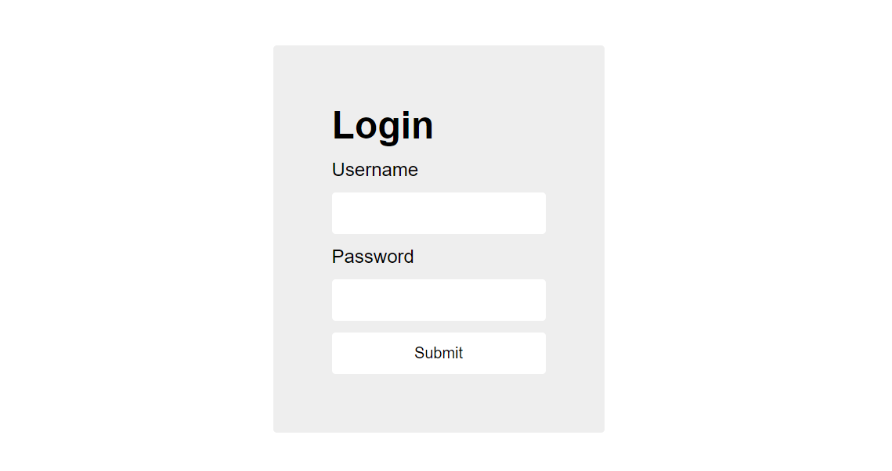
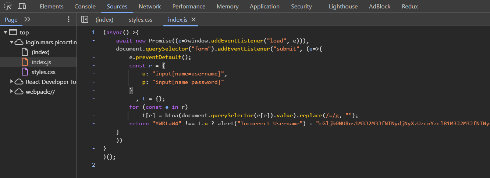
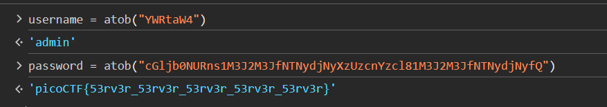
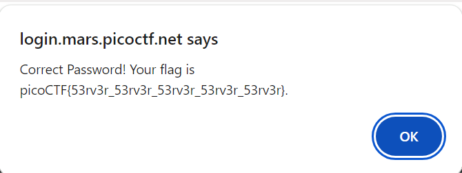

# login 

This is the write-up for the challenge "login" challenge in PicoCTF

# The challenge

## Description
My dog-sitter's brother made this website but I can't get in; can you help?
[login.mars.picoctf.net](https://login.mars.picoctf.net/)

## Initial look
The above link takes you to a basic HTML page with login form

# How to solve it
* I opened the source code of the given login form specifically focusing on the "index.js" file that look like this:

* At the last line of code I noticed that they checked whether the variables `t.u` and `t.p` are equal to certain other strings.
* As I saw in the code - object `t` stores the values of the username input and the password input after applay `btoa()` method to the strings. This method creates a Base64-encoded ASCII string from a binary string. Then I found that `atob()` method serves as the opposite - it gets a Base64 string and returns binary string.
* I extracted the base64 strings from the source code and applied on them the `atob()` method to find the username and the password.

* As you can see, I got `username = 'admin'` and `password = 'picoCTF{53rv3r_53rv3r_53rv3r_53rv3r_53rv3r}'`.
* Finally, by entering the above username and password I received an alert with the flag.

## flag
The flag is `picoCTF{53rv3r_53rv3r_53rv3r_53rv3r_53rv3r}`

Cheers 😄